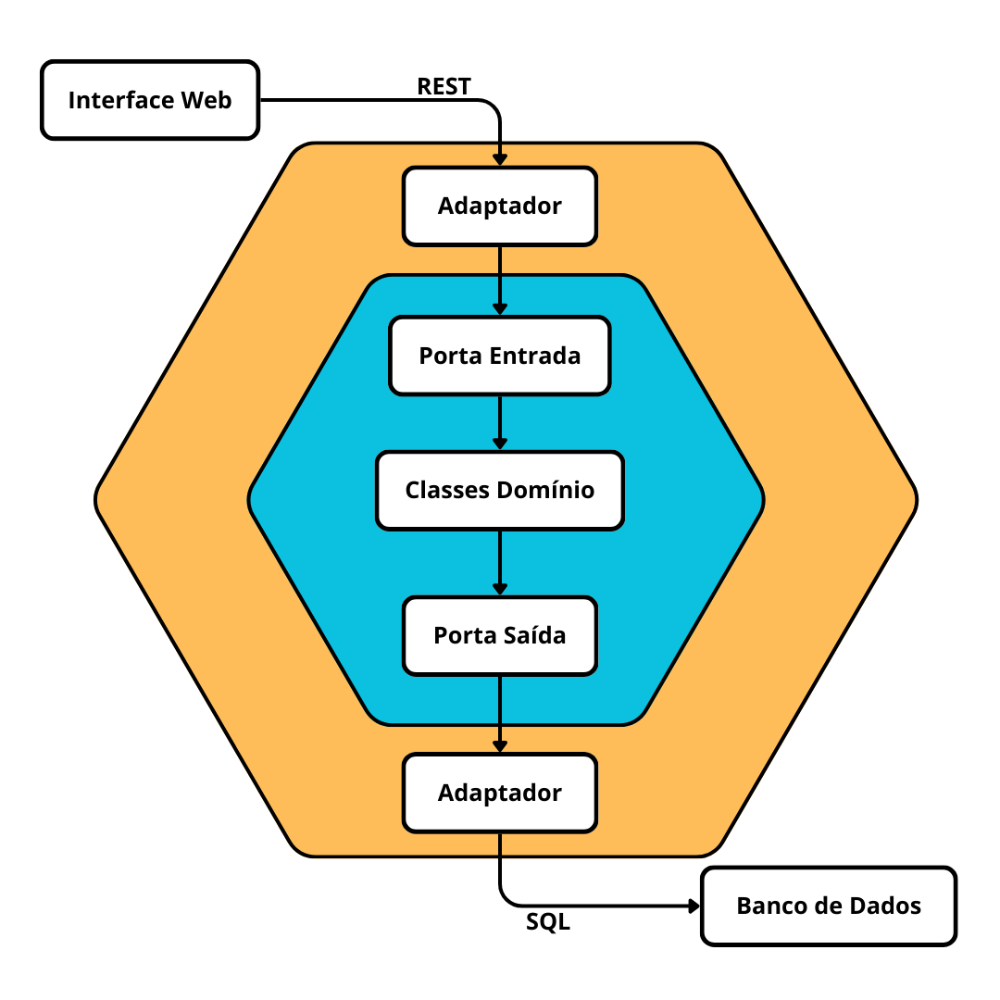

# Arquitetura Hexagonal - Exemplo Prático

## Introdução

A **Arquitetura Hexagonal**, também conhecida como **Arquitetura de Portas e Adaptadores** (Ports and Adapters), foi proposta por Alistair Cockburn com o objetivo de criar sistemas de software que sejam mais fáceis de manter, testar e evoluir. A principal ideia por trás dessa arquitetura é desacoplar a lógica de negócio das interações externas, como interfaces de usuário, bancos de dados, sistemas externos, etc., permitindo que as partes internas do sistema evoluam de forma independente.

## Motivação

Em arquiteturas tradicionais, como a arquitetura em camadas, as dependências normalmente fluem de cima para baixo, da camada de apresentação para a camada de persistência. Isso pode tornar o sistema difícil de modificar ou testar, pois as camadas são fortemente acopladas. A arquitetura hexagonal propõe uma separação clara entre as regras de negócio (núcleo da aplicação) e os mecanismos externos que interagem com essas regras, como interfaces de usuário, APIs, e sistemas de persistência.

### Principais Conceitos

1. **Portas (Ports)**: São interfaces que definem como as interações com o núcleo da aplicação podem ser feitas. As portas permitem que a lógica de negócio seja completamente isolada das tecnologias e ferramentas utilizadas.
  
2. **Adaptadores (Adapters)**: São implementações concretas das portas, que adaptam a comunicação entre o núcleo da aplicação e o mundo exterior. Os adaptadores podem ser, por exemplo, controladores de API, repositórios de persistência, ou interfaces de usuário.

3. **Núcleo (Core)**: Contém as regras de negócio e não tem dependências diretas de outras camadas. Isso garante que a lógica de negócio seja independente e facilmente testável.

## Exemplo Prático: Gestão de Filmes

### Visão Geral do Projeto

Este projeto é um exemplo prático de aplicação da Arquitetura Hexagonal para a gestão de filmes. O objetivo principal é demonstrar como aplicar os conceitos de Arquitetura Hexagonal, separando a lógica de negócio das interações externas.

### Diagrama da Arquitetura

Na figura, podemos observar que os usuários acessam o sistema por meio da interface Web, mas mesmo com a adição de novas interfaces, como mobile e ou um sistema externo, independentemente da forma de acesso, todos serão mediados por adaptadores. Esses adaptadores, por sua vez, comunicam-se com uma porta de entrada, que define métodos para pesquisa no catálogo de filmes, realização de reservas, cadastro de usuários, etc. Concretamente, esses métodos são implementados pelas classes de domínio. No sistema em questão, essas classes incluem Filme, Usuario, Administrador, Reserva, Empréstimo, etc.

O sistema também precisa persistir algumas informações. Para isso, utiliza uma porta de saída, com métodos para salvar e ler dados de filmes, salvar e ler dados de reservas, etc. Conectado a essa porta, há um adaptador que realiza as operações em um banco de dados relacional.

Um sistema pode possuir várias portas de entrada e de saída (sempre localizadas no hexágono interior, junto às classes de domínio). Em cada porta, seja ela de entrada ou de saída, é possível conectar um ou mais adaptadores, que ficam sempre localizados no hexágono mais externo.

## Executando a Aplicação

Para utilizar a aplicação basta seguir os passos descritos abaixo:

1. Acesse o link: https://replit.com/@LuizGustavo70/Exemplo-de-Arquitetura-Hexagonal-Gestao-de-Filmes?v=1
2. Faça um fork do repositório. Para isso, basta clicar no botão Fork no canto superior direito da página.
3. Execute o exemplo, clicando no botão Run centralizado na parte superior da tela.
4. Interaja com a aplicação e a parte de pesquisa para ver o funcionamento do exemplo.
5. Observe no código como a separação entre a lógica de negócios e as interfaces externas é realizada.

## Testes e Extensibilidade

Graças à separação de responsabilidades proporcionada pela Arquitetura Hexagonal, é fácil substituir a implementação do repositório em memória por uma persistência real, como um banco de dados, sem modificar a lógica de negócio. Da mesma forma, podemos adicionar novas interfaces de usuário ou APIs sem afetar o núcleo da aplicação.

## Conclusão

Este exemplo prático mostra como a Arquitetura Hexagonal pode ser aplicada em um projeto simples, proporcionando uma estrutura flexível e escalável. O código fonte está organizado de forma a facilitar a manutenção e a evolução do sistema, permitindo que novas funcionalidades sejam adicionadas com mínimo impacto no restante da aplicação.